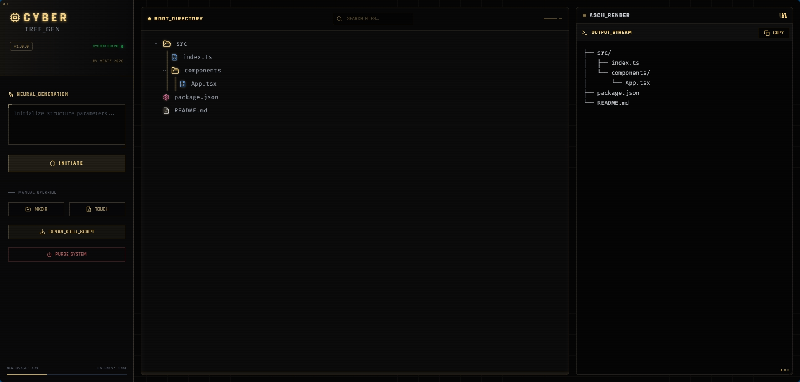

<div align="center">

# 🌳 CYBERTREE
### Neural-Powered File Structure Architecture System

[](https://www.typescriptlang.org/)
[](https://reactjs.org/)
[](https://vitejs.dev/)
[](LICENSE)

</div>

---



---

**CyberTree** is a futuristic, cyberpunk-themed developer tool designed to visualize, generate, and export file structures for your projects. Powered by AI (Local LLMs or Google Gemini), it converts natural language prompts into executable shell scripts.

<div align="center">

**[▶️ Try it Live](https://cybertree-folder-generator.vercel.app/)** · **[📚 Documentation](#-features)** · **[🐛 Report Issue](https://github.com/me-yeatz/Cybertree_Folder_Generator/issues)**

</div>

---

## 👨‍💻 Author

**Made with ❤️ by [me.yeatz](https://github.com/me-yeatz)**

- 🌐 GitHub: [github.com/me-yeatz](https://github.com/me-yeatz)
- 📧 Contact: [Open an Issue](https://github.com/me-yeatz/Cybertree_Folder_Generator/issues)

---

## ✨ Features

### 🤖 AI-Powered Generation

- **Neural Generation**: Describe your app (e.g., "A modern React app with Redux") and get a perfect folder structure instantly
- **Local & Cloud AI**: Supports Google Gemini or Local LLMs (LM Studio, Ollama) via standard OpenAI-compatible API

### 🖥️ Visual Interface

- **Cyberpunk UI**: Fully immersive "System Interface" with glassmorphism, neon glows, and scanline effects
- **Visual Tree Editor**: Interactive tree view to manually add, rename, delete, and toggle folders
- **Search & Filter**: Real-time search through your file structure with auto-expansion
- **ASCII Preview**: Live ASCII tree generation for documentation or `README.md`
- **Shell Export**: Export your design to a `.sh` script to auto-generate the actual directories and files

### ⚡ Developer Experience

- **Fast Build**: Powered by Vite for lightning-fast hot module replacement
- **Custom Theming**: Tailwind CSS with custom cyberpunk color palette
- **Type-Safe**: Full TypeScript support with strict mode enabled
- **Intuitive Interactions**: Double-click to rename, hover actions for quick operations

---

## 🛠️ Tech Stack

| Category | Technology |
|----------|------------|
| **Core** | React 18.2, TypeScript |
| **Build Tool** | Vite 7.x |
| **Styling** | Tailwind CSS 3.4, PostCSS |
| **Icons** | Lucide React |
| **AI Integration** | Google Generative AI, OpenAI-Compatible API |
| **Desktop** | Electron |
| **Fonts** | Rajdhani, Fira Code |

---

## 🚀 Getting Started

### Prerequisites

- Node.js 18+ or 20+
- npm or yarn

### Installation

```bash
# Clone the repository
git clone https://github.com/me-yeatz/Cybertree_Folder_Generator.git
cd Cybertree_Folder_Generator

# Install dependencies
npm install

# Copy environment configuration
cp .env.example .env
```

### Run Locally

```bash
# Start development server
npm run dev

# Build for production
npm run build

# Preview production build
npm run preview
```

### Desktop Application

```bash
# Build executable
npm run electron:build
```

<div align="center">

**🎉 Your app will be available at `http://localhost:5173`**

</div>

---

## ⚙️ Configuration

### Environment Variables

Create a `.env` file in the root directory:

```bash
# For Google Gemini
VITE_API_KEY=your_gemini_api_key_here

# For Local AI (LM Studio, Ollama)
VITE_AI_BASE_URL=http://localhost:1234/v1
VITE_AI_MODEL=local-model
VITE_AI_API_KEY=lm-studio
```

### AI Provider Setup

#### Google Gemini
1. Get API key from [Google AI Studio](https://makersuite.google.com/app/apikey)
2. Add to `.env` as `VITE_API_KEY`
3. Restart development server

#### Local AI (LM Studio/Ollama)
1. Install LM Studio or Ollama
2. Start the API server (default: `http://localhost:1234/v1`)
3. Configure `.env` with appropriate model name
4. No API key typically required for local instances

---

## 📁 Project Structure

```
CyberTree/
├── components/           # React components
│   ├── LandingPage.tsx  # Immersive entry experience
│   ├── AsciiPreview.tsx # ASCII tree preview panel
│   └── TreeNodeItem.tsx # Individual tree node component
├── services/            # API integration
│   ├── aiService.ts    # Local AI (OpenAI-compatible)
│   └── geminiService.ts # Google Gemini integration
├── utils/              # Utility functions
│   └── treeUtils.ts   # Tree manipulation & export logic
├── App.tsx            # Main application component & View Switcher
├── index.tsx          # React entry point
├── types.ts           # TypeScript interfaces
├── constants.ts       # App constants & initial tree
├── electron-main.cjs  # Electron main process
└── vite.config.ts     # Vite build configuration
```

---

## 🎨 Customization

### Colors

The cyberpunk theme uses a custom color palette in `tailwind.config.js`:

```javascript
colors: {
    cyber: {
        gold: '#ffdb89',      // Primary accent
        black: '#050505',     // Background
        gray: '#1f1f22',      // Secondary
        dark: '#0f0f10'       // Dark panels
    }
}
```

### Fonts

- **Rajdhani**: Tech-styled headings
- **Fira Code**: Monospace for code elements

---

## 🔧 Build Scripts

| Command | Description |
|---------|-------------|
| `npm run dev` | Start Vite development server |
| `npm run build` | Build for production |
| `npm run preview` | Preview production build |
| `npm run lint` | Run ESLint |
| `npm run electron` | Run Electron in development |
| `npm run electron:build` | Build Electron executable |

---

## 📱 Platform Support

| Platform | Status |
|----------|--------|
| **Windows** | ✅ Primary |
| **macOS** | ✅ Supported |
| **Linux** | ✅ Supported |
| **Web** | ✅ Supported |
| **Mobile** | ⚠️ Limited |

---

## 🐛 Troubleshooting

### Build Issues

**Problem**: TypeScript compilation errors
```
Solution: Ensure you're using Node.js 18+ and have run `npm install`
```

**Problem**: Electron build fails
```
Solution: Run `npm run build` first to create the dist/ folder
```

### AI Connection Issues

**Problem**: "API Key not found"
```
Solution: Check your .env file is in the root directory and contains VITE_API_KEY
```

**Problem**: Local AI connection refused
```
Solution: Verify LM Studio/Ollama is running on the configured port (default: 1234)
```

**Problem**: AI returns no results
```
Solution: Try a more specific prompt or verify model name in VITE_AI_MODEL
```

---

## 🤝 Contributing

Contributions are welcome! Please follow these guidelines:

1. **Code Style**: Follow existing TypeScript patterns
2. **Theme**: Maintain the cyberpunk aesthetic
3. **Components**: Use existing Tailwind utility classes
4. **Tests**: Add tests for new features
5. **Documentation**: Update README for new features

---

## 📄 License

This project is provided as-is for educational and personal use.

---

## 🙏 Acknowledgments

- **React** - UI framework
- **Vite** - Build tool
- **Tailwind CSS** - Styling
- **Lucide** - Icon library
- **Google Gemini** - AI generation
- **Electron** - Desktop framework

---

<div align="center">

**Made with ❤️ by [me.yeatz](https://github.com/me-yeatz) © 2026**

⭐ Star this repo if you find it helpful!

</div>
